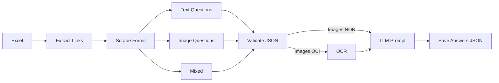

# Microsoft Forms AI – Multi‑Agent & LangChain Pipeline

Suite complète pour :
1. Extraire des liens Microsoft Forms depuis Excel
2. Scraper formulaires (questions + types + images)
3. Détecter présence d'images et exécuter OCR (EasyOCR)
4. Générer réponses automatiques via un LLM local (Ollama)
5. Enrichir et versionner les JSON (OCR + réponses)

## 🚀 Principales fonctionnalités

- Extraction de liens depuis Excel (`ExcelLinksExtractorAgent`)
- Scraping complet texte + images (`MicrosoftFormsCompleteAnalysisAgent`)
- Détection questions avec images (`JsonImageDetectorAgent`)
- OCR multi‑langues (EasyOCR) sur images (`FormsImageExtractionAgent`)
- Détection de langue (`TextLanguageDetectionAgent`)
- Génération de réponses LLM (Ollama + modèle `qwen3:8b`) via prompts structurés
- Pipeline orchestrée LangChain (`LangChainPipelineAgent`)
- Enrichissement incrémental des JSON : `_with_ocr_*`, puis `_with_answers` 
- Gestion des erreurs et logs étape par étape

## 🧠 Flux (Pipeline)



## 📁 Structure actuelle (src/)

```
src/
  AnswerMiningAgent.py               # Détection type / options question (support interne)
  ExcelLinksExtractorAgent.py        # Extraction liens MS Forms depuis Excel
  FormsImageExtractionAgent.py       # OCR sur images et enrichissement JSON
  JsonImageDetectorAgent.py          # Booléen presence images
  JsonQuestionExtractorAgent.py      # Extraction questions / types / valeurs
  LlamaLanguageModelAgent.py         # Interface Ollama avec fallback
  MicrosoftFormsCompleteAnalysisAgent.py # Scraping principal (questions + images)
  TextLanguageDetectionAgent.py      # Détection de langue
  LangChainPipelineAgent.py          # Orchestration globale
```

## 📋 Prérequis

- Python 3.10+
- Google Chrome installé
- Accès Internet
- Modèle LLM local via [Ollama](https://ollama.com) (optionnel pour génération réponses)

## 🛠 Installation

```powershell
git clone git@github.com:ISSAM-SALMI/Microsoft-forms-AI.git
cd Microsoft-forms-AI
python -m venv venv
venv\Scripts\activate
pip install -r requirements.txt
pip install easyocr langdetect langcodes  # si manquants
ollama pull qwen3:8b  # si utilisation LLM
```

## ▶️ Lancer la pipeline complète

```powershell
python .\src\LangChainPipelineAgent.py
```

Résultat :
- JSON brut: `data/output/jsons/microsoft_forms_complete_data_*.json`
- Après OCR: `*_with_ocr_*.json`
- Après réponses LLM: `*_with_answers.json`
- Images: `data/output/images/`

## 🔍 Exécution d'agents individuels

| Objectif | Commande | Sortie |
|----------|----------|--------|
| Scraper un seul formulaire | (URL codée dans `MicrosoftFormsCompleteAnalysisAgent.py`) | JSON brut |
| OCR sur tous les JSON | `python .\src\FormsImageExtractionAgent.py` | JSON enrichis OCR |
| Vérifier présence images | `python .\src\JsonImageDetectorAgent.py` | True/False |
| Extraire Q/A | `python .\src\JsonQuestionExtractorAgent.py` | Console |

## 🧬 Format JSON enrichi (extrait)

```json
{
  "url": "...",
  "contains_images": true,
  "questions": [
    {
      "question_number": 1,
      "question_text": "Original | OCR: Texte image",
      "answer_type": "choiceItem",
      "answer_values": ["A","B"],
      "images": [
        {"filename": "question_1_image_1_....jpg", "question_text": "Texte OCR"}
      ],
      "llm_answer": "B",
      "llm_language_detected": "German"
    }
  ]
}
```

## ⚙️ Chrome / Selenium

Options utilisées : `--headless=new`, `--no-sandbox`, `--disable-dev-shm-usage`, `--disable-gpu`, `--disable-web-security`.

## 🧪 Robustesse / Fallback

- LLM : si Ollama absent -> réponse `FALLBACK_*`
- OCR : si EasyOCR non installé -> étape ignorée
- Timeouts LLM configurés (30–35s)

## ❗ Limitations actuelles

- Une seule feuille Excel (premier fichier détecté)
- Pas de parallélisation LLM
- Pas de reprise incrémentale fine si interruption

## 🔮 Prochaines améliorations possibles

- Paramètres CLI (limiter liens, désactiver OCR, etc.)
- Cache des réponses LLM
- Export CSV agrégé
- Support multi-modèles Ollama

## 🤝 Contribution

1. Fork
2. Branche feature
3. Commit / push
4. Pull Request

## ⚠️ Avertissement

Utiliser uniquement sur des formulaires que vous êtes autorisé à analyser. Respecter les CGU Microsoft.

## 📞 Support

Ouvrir une issue GitHub ou vérifier le dossier `data/output/` (JSON + logs implicites).

---
Made with modular agents + LangChain pipeline.