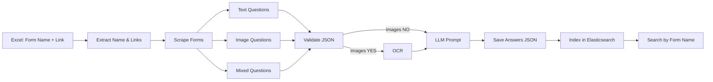

# Microsoft Forms AI – Multi‑Agent & LangChain Pipeline

Suite complète pour :
1. Extraire des liens Microsoft Forms depuis Excel (avec nom de formulaire)
2. Scraper formulaires (questions + types + images), stockage du nom de formulaire dans chaque JSON
3. Détecter présence d'images et exécuter OCR (EasyOCR)
4. Générer réponses automatiques via un LLM local (Ollama)
5. Enrichir et versionner les JSON (OCR + réponses)
6. Indexer les réponses, justifications et questions dans Elasticsearch (recherche par nom de formulaire)

## 🚀 Principales fonctionnalités

- Extraction de liens depuis Excel (`ExcelLinksExtractorAgent`) avec nom de formulaire
- Scraping complet texte + images (`MicrosoftFormsCompleteAnalysisAgent`), stockage du nom de formulaire dans le JSON
- Détection questions avec images (`JsonImageDetectorAgent`)
- OCR multi‑langues (EasyOCR) sur images (`FormsImageExtractionAgent`)
- Détection de langue (`TextLanguageDetectionAgent`)
- Génération de réponses LLM (Ollama, modèle par défaut configurable, ex. `qwen3:8b` ou `deepseek-r1:8b`)
- Mécanisme de retry sur TIMEOUT LLM (jusqu'à 4 tentatives avant fallback)
- Fallback automatique quand Ollama absent / timeout / sortie vide (`FALLBACK_*_AUTO_ANSWER`)
- Pipeline orchestrée LangChain (`LangChainPipelineAgent`)
- Indexation des réponses dans Elasticsearch (`ElasticsearchUploaderAgent`), recherche par nom de formulaire
- Nettoyage automatique des intermédiaires: suppression des JSON `_with_ocr_*` et des images après création du JSON final avec réponses
- Logging unifié coloré (module `logging_utils`) + niveaux configurables
- Enrichissement JSON final avec `llm_answer`, `llm_language_detected`, `form_name`

## 🧠 Flux (Pipeline)



## 📁 Structure principale

```
main.py                              # Point d'entrée simple (run pipeline)
LangChainPipelineAgent.py            # Wrapper racine important la version src/
src/
  __init__.py                        # Package marker
  logging_utils.py                   # Logger unifié (log, log_section)
  AnswerMiningAgent.py               # Typage & extraction options
  ExcelLinksExtractorAgent.py        # Extraction liens Excel (nom + lien)
  ElasticsearchUploaderAgent.py      # Indexation dans Elasticsearch (recherche par nom)
  FormsImageExtractionAgent.py       # OCR enrichisseur JSON
  JsonImageDetectorAgent.py          # Détection images (bool)
  JsonQuestionExtractorAgent.py      # Normalisation questions
  LlamaLanguageModelAgent.py         # Interface Ollama (timeout + fallback)
  MicrosoftFormsCompleteAnalysisAgent.py # Scraping complet formulaire
  TextLanguageDetectionAgent.py      # Détection de langue
  LangChainPipelineAgent.py          # Orchestration (steps + cleanup + retries)
data/
  input/                             # Fichiers Excel
  output/
    jsons/                           # JSON brut & finaux
    images/                          # Images (supprimées après final si cleanup actif)
```

## 📋 Prérequis

- Python 3.10+
- Google Chrome installé
- Accès Internet
- Modèle LLM local via [Ollama](https://ollama.com) (optionnel pour génération réponses)

## 🛠 Installation

```powershell
git clone git@github.com:ISSAM-SALMI/Microsoft-forms-AI.git
cd Microsoft-forms-AI
python -m venv venv
venv\Scripts\activate
pip install -r requirements.txt
pip install easyocr langdetect langcodes  # si manquants
ollama pull qwen3:8b  # si utilisation LLM
```

## ▶️ Lancer la pipeline complète

Méthodes équivalentes (choisissez) :

```powershell
# 1. Point d'entrée principal
python .\main.py

# 2. Module package
python -m src.LangChainPipelineAgent

# 3. Wrapper racine
python .\LangChainPipelineAgent.py
```

Résultat :
- JSON brut: `data/output/jsons/microsoft_forms_complete_data_*.json`
- JSON final: `*_with_answers.json`
- (Les JSON intermédiaires `_with_ocr_*` et les images sont supprimés si cleanup actif)

Pour désactiver le nettoyage (garder images et JSON OCR) : modifier dans `src/LangChainPipelineAgent.py`:
```python
CLEANUP_OCR_JSON = False
CLEANUP_IMAGES = False
```

## 🔍 Exécution d'agents individuels

| Objectif | Commande | Sortie |
|----------|----------|--------|
| Scraper un seul formulaire | (URL codée dans `MicrosoftFormsCompleteAnalysisAgent.py`) | JSON brut |
| OCR sur tous les JSON | `python .\src\FormsImageExtractionAgent.py` | JSON enrichis OCR |
| Vérifier présence images | `python .\src\JsonImageDetectorAgent.py` | True/False |
| Extraire Q/A | `python .\src\JsonQuestionExtractorAgent.py` | Console |

## 🧬 Format JSON enrichi (extrait)

```json
{
  "url": "...",
  "form_name": "Nom du formulaire depuis Excel",
  "contains_images": true,
  "questions": [
    {
      "question_number": 1,
      "question_text": "Original | OCR: Texte image",
      "answer_type": "choiceItem",
      "answer_values": ["A","B"],
      "images": [
        {"filename": "question_1_image_1_....jpg", "question_text": "Texte OCR"}
      ],
      "llm_answer": "B",
      "llm_justification": "Justification concise générée par LLM",
      "llm_language_detected": "German"
    }
  ]
}
```

## 🔎 Recherche et indexation dans Elasticsearch

Les réponses, justifications et questions sont indexées dans Elasticsearch avec le nom du formulaire (`form_name`).
Vous pouvez retrouver toutes les réponses d'un formulaire par son nom :

```python
from elasticsearch import Elasticsearch
es = Elasticsearch(['http://localhost:9200'])
form_name = "Nom du formulaire à rechercher"
response = es.search(index="forms_ai", query={"match": {"form_name": form_name}}, size=10)
for doc in response["hits"]["hits"]:
    print(doc["_source"])
```

Le module `ElasticsearchUploaderAgent.py` gère l'indexation automatique à la fin du pipeline.

## ⚙️ Chrome / Selenium

Options utilisées : `--headless=new`, `--no-sandbox`, `--disable-dev-shm-usage`, `--disable-gpu`, `--disable-web-security`.

## 🧪 Robustesse / Fallback / Retry

- LLM absent / erreur / timeout / sortie vide → `FALLBACK_<RAISON>_AUTO_ANSWER`
- TIMEOUT: jusqu'à 4 retries automatiques avant abandon
- OCR absent (EasyOCR non installé) → étape ignorée proprement
- Fermeture Chrome sécurisée (destructeur neutralisé) pour éviter `WinError 6`
- Décodage UTF‑8 forcé avec remplacement pour éviter erreurs d'encodage Windows

## ❗ Limitations actuelles

- Première feuille / premier fichier Excel seulement
- Pas encore de parallélisation LLM ni pooling
- Pas de CLI pour activer/désactiver dynamiquement OCR / cleanup / retries
- Pas de cache réponses LLM

## 🔮 Prochaines améliorations possibles

- Paramètres CLI (limiter liens, désactiver OCR, changer modèle, retries dynamiques)
- Cache des réponses LLM / persistance
- Export CSV agrégé (questions + réponses)
- Support multi-modèles & fallback hiérarchique
- Parallélisation / batching LLM
- Mode verbose/debug via variable env
- Option conservation images pour audit

## 🤝 Contribution

1. Fork
2. Branche feature
3. Commit / push
4. Pull Request

## ⚠️ Avertissement

Utiliser uniquement sur des formulaires que vous êtes autorisé à analyser. Respecter les CGU Microsoft.

## 🧾 Logging

Logger unifié (`logging_utils.log`) avec niveaux: DEBUG / INFO / WARN / ERROR

Variables d'environnement :
```powershell
$Env:FORMS_AI_LOG_LEVEL = "INFO"   # ou DEBUG
$Env:FORMS_AI_LOG_COLOR = "1"      # 0 pour désactiver couleurs
```

## 📞 Support

Ouvrir une issue GitHub ou vérifier `data/output/jsons` et la console (logs structurés).

---
Made with modular agents + LangChain pipeline + unified logging.